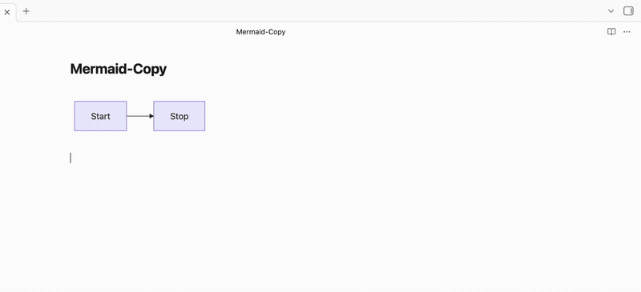

# Mermaid Copy

An Obsidian plugin that adds a copy button to rendered Mermaid diagrams in Live Preview mode.

## Features

- One-click copy of any Mermaid diagram
- Copy as **PNG** (image) or **SVG** (markup) — configurable in settings
- Button appears next to the existing edit button on each diagram
- Transparent PNG background preserves theme colors

## Usage

1. Write a Mermaid code block in any note
2. In Live Preview, hover over the rendered diagram
3. Click the copy icon (next to the edit icon)
4. Paste into any app — Slack, Docs, email, etc.

## Settings

**Copy format** — Choose between PNG (default) and SVG output.

## Installation

### From Community Plugins

> This plugin is currently under review for the Obsidian Community Plugin directory. Once approved, you will be able to install it directly from Settings > Community Plugins.

### Manual

1. Go to the [latest release](https://github.com/MBlogs/mermaid-copy/releases/latest)
2. Download the three files: `main.js`, `manifest.json`, and `styles.css`
3. In your vault folder, create `.obsidian/plugins/mermaid-copy/`
4. Move the three downloaded files into that folder
5. Open Obsidian, go to Settings > Community Plugins, and enable **Mermaid Copy**
